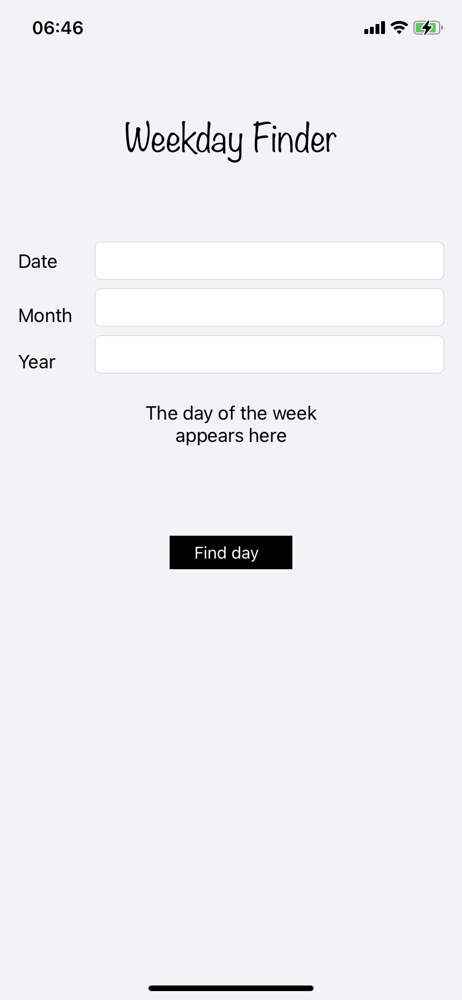
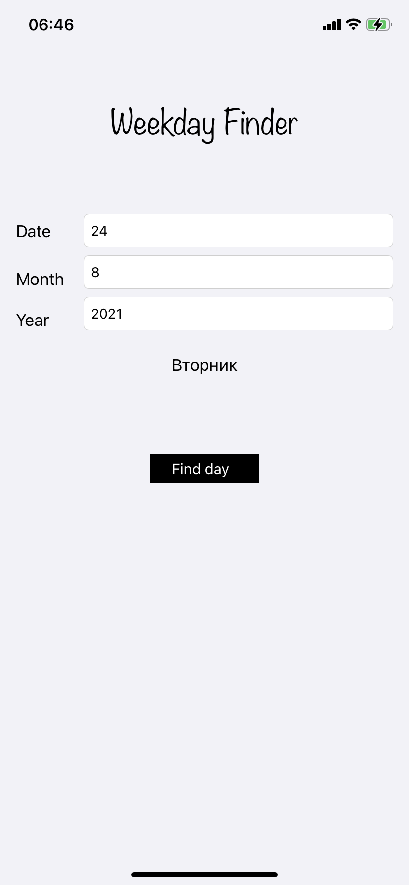

# About the application

<pre>This is a homework assignment for creating a simple application based on View Controller.
The application consists of one screen and works with simple UI-objects(Label, TextField, Button).
A lot of work has been done with Constraints in Interface Builder.</pre>

## Application screenshots

 
